# relief-atlas

<p align="center">
  <picture>
    <source media="(prefers-color-scheme: dark)" srcset="assets/logo-dark.svg">
    <source media="(prefers-color-scheme: light)" srcset="assets/logo-light.svg">
    
  </picture>
</p>

**10,000+ 3D mesh assets for disaster relief, humanitarian aid, and civil protection.**

AI-generated polygonal meshes (GLB) for use in robotics simulation, embodied AI training, and disaster response planning. Covers equipment and vehicles from Germany (DRK, THW, Feuerwehr, Bundeswehr), EU Civil Protection, Ukraine recovery operations, and global natural disaster response.

## Dataset

- **10,079 items** across 4 geography manifests, of which **9,509 are generated
  by default** — a content policy gate refuses 30 and gates 540 behind an
  explicit flag (see [Content policy](#content-policy))
- Original generation: GPT-Image → Trellis 2 / Tripo v3.1 / Hunyuan3D pipeline (cloud)
- Local generation: FLUX.2 [klein] 4B → TRELLIS.2-4B on Apple Silicon (see below)
- Prompts optimized for image-to-3D: natural language, camera specifications, explicit constraints

## Geography

| Region | Items | Organizations |
|--------|-------|---------------|
| Germany | 4,079 | DRK, THW, Feuerwehr, Bundespolizei, Bundeswehr |
| EU | 2,500 | ECHO, Civil Protection, Red Cross, Member States |
| Ukraine | 2,500 | Conflict recovery, humanitarian aid, rebuilding |
| General | 1,000 | Global disaster response, natural disasters |

## Structure

```
scripts/              — Generation pipeline (prompts, mesh generation, verification)
scripts/local/        — On-device pipeline (FLUX.2 klein -> TRELLIS.2, mesh + 3DGS)
tests/                — Pipeline self-tests (policy, QA contracts, exporters)
manifests/            — Item definitions with pre-generated prompts
outputs_relief/       — Generated 3D meshes (GLB + 3DGS + PNG + metadata), untracked
state/                — Run checkpoints, QA verdicts, policy ledgers, untracked
legacy_original/      — Pre-existing meshes from earlier generation runs, untracked
legacy_original_scripts/ — Earlier generation scripts (reference)
config/               — API key configuration (placeholder example only; real keys are git-ignored)
```

All generation runs **fully on-device** on Apple silicon (MPS for training
models, [MLX](https://github.com/ml-explore/mlx) for matrix-heavy steps) —
no cloud GPUs, no payloads leave the machine.
```

## Setup

```bash
pip install -r requirements.txt
cp config/api_keys.example.txt config/api_keys.txt
# Edit config/api_keys.txt with your fal.ai and Runware keys
```

## Usage

```bash
# Verify setup
python scripts/generate_relief.py --dry-run

# Generate meshes (all providers)
python scripts/generate_relief.py

# Use only one provider
python scripts/generate_relief.py --provider fal
python scripts/generate_relief.py --provider runware

# Check progress
python scripts/verify_outputs.py
```

## Technical Details

- **Image generation**: GPT-Image-1.5/2 with structured natural language prompts
- **3D generation**: Trellis 2 (4B), Tripo v3.1, Hunyuan3D 3.1-Rapid
- **Trellis 2 settings**: `ss_guidance_strength: 8.0`, `resolution: 1024`, `textureSize: 2048`
- **Tripo v3.1 settings**: `geometryQuality: detailed`, `pbr: true`, `imageAutoFix: true`
- **Output**: GLB with PBR textures, reference PNG, metadata JSON

## Local generation pipeline (on-device)

The same 10,079 manifest items can be regenerated **entirely on-device** on
Apple Silicon (developed on M4 Max, 128GB) — no API keys, no cloud calls:

| Stage | Model | Runtime |
|-------|-------|---------|
| Text-to-image | FLUX.2 [klein] 4B (Apache-2.0) | diffusers on MPS |
| Matting | BiRefNet (MIT) saliency matting, chroma-hysteresis fallback | transformers on CPU |
| Image-to-3D | TRELLIS.2-4B via [trellis-mac](https://github.com/shivampkumar/trellis-mac) | PyTorch MPS + Metal bake |
| Safety screen | Falconsai/nsfw_image_detection (Apache-2.0) | transformers on CPU |

Each item produces **both** representations:

- `<item_id>.glb` — PBR-textured mesh (Metal-baked base color / metallic / roughness)
- `<item_id>.spz` + `<item_id>.splat` — 3D Gaussian Splats converted from
  TRELLIS.2's decoded voxel grid, in both containers: Niantic's compressed
  `.spz` (~10× smaller than PLY) and the universal `.splat` (32 B/splat) that
  any web viewer loads. When the `spz` package is unavailable only the `.splat`
  is written; the raw float32 INRIA `.ply` is written only with
  `condensed=False`
- `<item_id>.png` — RGBA reference image (alpha lets TRELLIS.2 skip its gated background remover, so the run is fully offline)
- `metadata.json` — prompt, models, seed, timings, vertex/gaussian counts, and the QA + content-policy verdicts the asset passed

```bash
# One-time workspace setup (~40GB of weights, no HF login required)
scripts/local/setup_local.sh

# Smoke test
python3 scripts/local/run_all.py --limit 2

# Full run (checkpointed; safe to relaunch)
python3 scripts/local/run_all.py

# Unattended multi-day run
nohup scripts/local/run_forever.sh > state/full_run.log 2>&1 &

# Progress report: completion, QA verdicts, quarantine, policy standing
python3 scripts/local/verify_local.py

# Pipeline self-tests (no model weights needed)
python3 -m unittest discover -s tests
```

Model weights live outside git in `meshmaker/local/models/` (~38GB: FLUX.2 22G,
TRELLIS.2 15G, BiRefNet 424M, NSFW detector 1.4G); `scripts/local/setup_local.sh`
rebuilds the workspace from scratch.

### Quality gates

Generation is checkpointed and gated at three stages, with verdicts in `state/`.
Both geometry gates run the same **10-lens turntable protocol** — 8 azimuths
around the object plus top and bottom poles, in fixed order — so every asset
is inspected from all sides, and each pass writes a contact-sheet montage
(`<id>.qa_views.png` / `<id>.qa_mesh_views.png`) for human review:

| Gate | Checks | On failure |
|------|--------|------------|
| Image QA (phase 1.5) | alpha coverage, matte fragmentation, border contact, sharpness, near-duplicate subjects, NSFW | deletes the PNG and perturbs the item's seed so regeneration explores a new sample |
| Mesh QA (phase 2.5) | loads, bbox aspect, white-slab regression, backdrop residue, degenerate triangles, turntable silhouettes (coverage, view consistency) | deletes the GLB + 3DGS + metadata and perturbs the seed |
| 3DGS QA (phase 2.6) | native gaussian cues (non-finite positions, degenerate scales, dead splats, bad colors — the no-reference route of 3DGS-QA, AAAI 2026), turntable renders (coverage, opacity solidity, enclosed holes, view consistency) | deletes the 3DGS containers + metadata so the mesh phase re-decodes with a perturbed seed |

The NSFW screen is **fail-closed**: a missing or unloadable detector aborts the
run rather than emitting an unscreened dataset. `--no-nsfw` is the explicit,
recorded opt-out. After three rejections an item is quarantined in
`state/qa_quarantine.json` instead of looping forever, and only items with a
*passing* image QA verdict are meshed.

## Content policy

The manifests are civil-protection and humanitarian assets, but rows inherited
from the project's earlier Bundeswehr mesh sets describe military materiel. The
QA gates measure pixels and geometry, so they are blind to subject matter;
`scripts/local/content_policy.py` screens each item's **text** before any pixel
is generated. Three tiers:

| Verdict | Meaning | Items | Default |
|---------|---------|-------|---------|
| `allowed` | civil-protection, humanitarian or dual-use-neutral | 9,509 | generated |
| `restricted` | unarmed military platform or personnel | 540 | refused; needs `--allow-restricted` |
| `blocked` | weapon, weapon platform or munition | 30 | refused; needs `--allow-blocked` |

Evaluation order is the substance of the policy: unambiguous weapon nouns match
first, so humanitarian framing cannot launder an assault rifle; a humanitarian
allowlist matches second, so demining, EOD/UXO clearance and PPE keep their
mine- and ordnance-related vocabulary; military platforms and combatants match
last. Scoped exemptions let a wildfire *water bomber*, a *torpedo-shaped*
rescue ROV and a *landmine detector* through without opening the weapon family.

```bash
# Audit every manifest -> state/content_policy_report.json
python3 scripts/local/content_policy.py --report

# Read what a tier actually caught, before trusting the gate
python3 scripts/local/content_policy.py --list blocked
python3 scripts/local/content_policy.py --list restricted --prompts

# Classify an arbitrary string
python3 scripts/local/content_policy.py --check "Pearson mine roller"

# Verify the policy against its 35-case regression table
python3 scripts/local/content_policy.py --selftest
```

**Overrides are explicit and recorded.** `--allow-restricted` and
`--allow-blocked` are accepted by every phase (including the QA gate, which
re-screens independently). Anything generated under an override is stamped
`policy.override = true` in its `metadata.json` and logged to
`state/content_policy_overrides.json`, so override output can always be told
apart from a default run and filtered out of a release. `--only-policy` scopes a
run to one tier, which is how you inspect what the gate catches without
generating the other 9,509 items:

```bash
# Generate only the blocked tier, for review
python3 scripts/local/run_all.py --only-policy blocked --allow-blocked
```

## License

Code is released under the [MIT license](LICENSE). See individual asset
metadata for licensing details.

## Sister Project

**[cobot-atlas](https://github.com/sepahead/cobot-atlas)** — 2,000+ meshes for robot simulation, manipulation research, and embodied AI ([DOI: 10.5281/zenodo.20697491](https://doi.org/10.5281/zenodo.20697491)).

## Citation

If you use relief-atlas in your research, please cite:

```bibtex
@dataset{relief_atlas_2026,
  author    = {Mahmoudian, Sepehr},
  title     = {relief-atlas: 10K+ 3D Mesh Assets for Disaster Relief and Civil Protection},
  year      = {2026},
  publisher = {GitHub},
  url       = {https://github.com/sepahead/relief-atlas}
}
```
